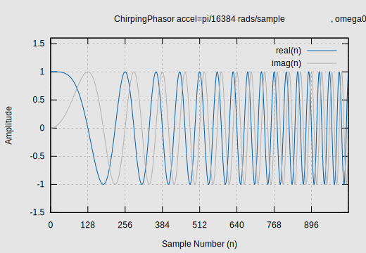

# ReiserRT_ChirpingPhasor

Frank Reiser's C++11 implementation of a fast and accurate, "chirping" sin/cos waveform pair (I/Q) generator.
This library component is dependent on the ReiserRT_FlyingPhasor shared object library.

## Overview

This tone generator evolved out of a desire to generate complex exponential waveforms (sinusoids) fast and accurately,
which would increase (or decrease) linearly in frequency over the course of time (samples). 
The traditional way of doing this, involved repeated calls to sin and cos functions with an accelerating, radian input argument.
This produces accurate results, at least over a limited domain interval. However, it is anything but fast.

If a continual sequence of accelerating complex values are what is required for an application,
the task of generating this sequence can be accomplished by simply rotating a phasor around the unit circle
by a linearly increasing (or decreasing) angular rate. 
The only trigonometric functions required, are invoked during initialization. 
After initialization, we require no more than a handful of arithmetic operations (maybe a couple handfuls).
This feat is accomplished by employing an instance of ReiserRT FlyingPhasorToneGenerator, a sprinkle of "state data"
and a little "loving care". It is essentially a reimplementation of FlyingPhasorToneGenerator which employs a
FlyingPhasorToneGenerator as a dynamic rate variable.

Care must be exercised to ensure that the dynamic rate variable
does not cross the nyquist point over the course of usage. If this is allowed to occur, positive frequency rolls over 
to negative and, in decelerating cases, negative frequency becomes positive. Otherwise, it is immune from
domain range limits since it does not track, or care about, "cycles". Angular velocity may be monitored via the
`getOmegaBar` operation, which returns the mean average velocity between the next two samples delivered.
Acceleration may be halted or otherwise modified via the `modifyAccel` operation.

## Details
A little more should be said regarding the "loving care" mentioned above.
This tone generator is taking advantage of Euler's mathematics of the unit circle. When you multiply two phasors,
you multiply the magnitudes and add the angles. When applied to unit vectors (magnitudes of one),
the resultant magnitude stays one, you simply add the angles. Our state data unit vectors are in rectangular form,
we simply preform a complex multiply in rectangular form, the resultant magnitude of which may drift away from one.
Because of this, a re-normalization cycle must be preformed on some periodic basis and this adds to the cost.
This tone generator performs this re-normalization every other sample. This was chosen for two reasons.
1) It puts any resultant re-normalization spur at the Nyquist rate (edge of bandwidth).
2) Re-normalizing at every other sample, keeps its noise contribution minimal.
   Additionally, with such small errors at every other cycle,
   a simple and inexpensive linear approximation is all that is required to maintain stability.

Regarding the "state data", this tone generator was designed to generate a single chirp per instance.
An instance is constructed with an initial acceleration, omega zero and a phase angle (phi).
When an initial number of samples are requested from an instance, they are delivered
from the starting phase angle at an accelerating radians per sample, rate. Subsequent sample requests,
are delivered in phase (continuous) with the previous samples delivered. An instance
may be "reset" however, to produce a different chirp. Resetting re-initializes all "state data"
as if the object were just constructed. The amount of state data maintained is fairly small.

# Example Data Characteristics
Here, we present some example data created with the 'streamChirpingPhasor' utility program included
with the project. We generated 1024 samples with an acceleration of pi/16384 radians per sample squared,
with an omega zero of of zero and a starting phase of zero.
This data is plotted below:

Figure 1 - Example Flying Phasor Sample Series Data



From the figure, we can see a linearly increasing frequency. The data is complex in nature. If you only
need the imaginary value, that can be extracted. The real value is calculated simultaneously for free
and may be useful for compensating for, or for creating doppler shifts with complex signal data.

# Interface Compatibility
This component has been tested to be interface-able with C++20 compiles. Note that the compiled library code
is built using the c++11 standard. API/ABI stability will be maintained between minor versions of this project.

# Dependencies
This component is dependent upon ReiserRT_FlyingPhasor, version 3.0 in order to configure and build.

# Thread Safety
This tone generator is not "thread safe". There are no concurrent access mechanisms
in place and there is no good reason for addressing this. To the contrary,
state left by one thread would make little sense to another, never mind the concurrency issues.
Have threads use their own unique instances.

# Acknowledgements
As with ReiserRT_FlyingPhasor, this algorithm was derived from something I saw on StackExchange. It however was
a non-chirping variety. This chirping variety is a compounding of that algorithm to achieve a dynamic rate
as opposed to a fixed one. It is essentially a FlyingPhasorToneGenerator within a FlyingPhasorToneGenerator.

## Building and Installation
This project requires cmake version 3.15 or higher. The procedure for configuring and building is
roughly as follows:

1) Obtain a copy of the project
2) Create a build folder within the project root folder.
3) Switch directory to the build folder and run the following
   to configure and build the project for your platform:
   ```
   cmake ..
   cmake --build .
   ```
4) Test the library
   ```
   ctest
   ```
5) Install the library as follows (You'll most likely
   need root permissions to do this):
   ```
   sudo cmake --install .
   ```
   Please see the "tests" and "sundry" folders for examples on how to use the ChirpingPhasor in
   your own projects.
